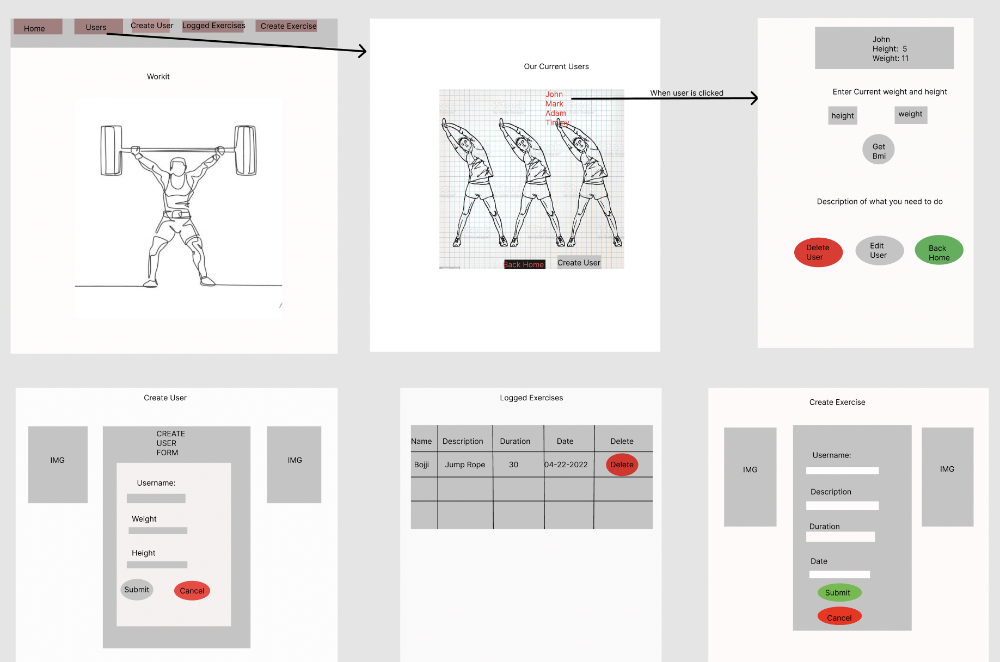
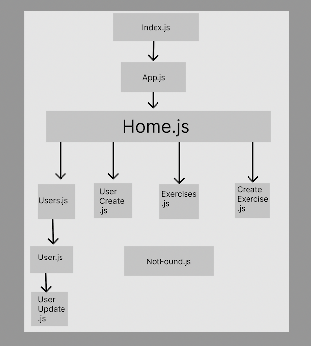

# 🏋🏼 Workit 💪🏽
Workit is a fun app that uses full CRUD operations.  
This simple app was created by yours truly, for the final Full-Stack-Project for Per-Scholas. 
I have gone thru many changes In my project but I still have a lot off additions I would like to add. See further down for more details. 

## DEPLOYMENT(Links)
Heroku https://final-workout-database.herokuapp.com/api/users 
Netlify https://stunning-semifreddo-6298ec.netlify.app/

## Workit is an exercise tracker for individuals who would like to track their time being active.

Individuals who sign up for the tracker will be able to do the following: 

> 1. Create a user 
> 2. Log measurements 
> 3. Get a calculation of bmi 
> 4. See how much weight that needs to be lost or gained 
> 5. Log an exercise 
> 6. Edit user  
> 7. Delete user  
> 8. See all logged exercises

## Technologies Used 👨🏽‍💻
* React v18
* Mongoose
* Nodejs
* Express

## Dependencies 
Frontend: 
* Axios
* React-Router
* React-Router-Dom

Backend: 
* Cors
* Dotenv
* Morgan
* Nodemon

## Wireframe

## Heirarchy

## MVP
* Full CRUD for User info
* Calculate BMI(adjusted by me)
* Log exercises
* View other Users info

## (POST) MVP
* User Auth(Sign in/Sign up/Auth view)
* User Avatar selection
* Meal plan suggestions based on user selection
* Workout demonstrations
* Workout planner feature
* Weekly Challenges

## API ENDPOINTS
* https://final-workout-database.herokuapp.com/api               HOME PAGE/ROOT
* https://final-workout-database.herokuapp.com/api/users         ACTIVE USERS 
* https://final-workout-database.herokuapp.com/api/create-user   CREATE USER
* https://final-workout-database.herokuapp.com/api/users/{id}/edit  EDIT USER PROFILE
* https://final-workout-database.herokuapp.com/api/users{id}      USER PROFILE  
* https://final-workout-database.herokuapp.com/api/exercises       Exercises LOGGED 
* https://final-workout-database.herokuapp.com/api/create-exercise  CREATE EXERCISE

## SCHEMAS
<pre>const User = new Schema(
  {
    name: { type: String, required: true },
    current_height: { type: String, required: true },
    current_weight: { type: String, required: true },
  },
  { timestamps: true }
);

const Exercise = new Schema(
  {
    name: { type: String, required: true },
    description: { type: String, required: true },
    duration: { type: Number, required: true },
    date: { type: String, required: true },
  },
  {
    timestamps: true,
  }
);

</pre>

